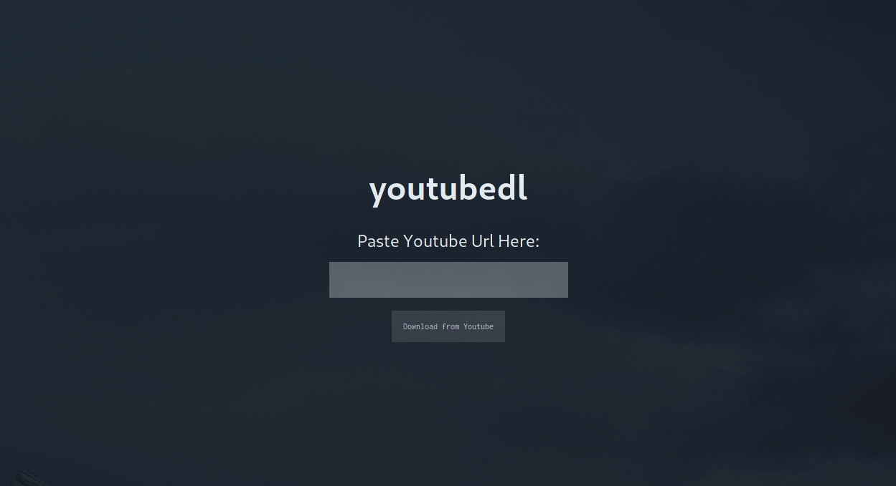

# youtubedl-gui 

Simple gui for the `youtube-dl` tool used to download videos directly from youtube. Currently only supports downloading

## Tech

**Client:** Svelte

**Backend:** Go, Wails

## Authors

- [@lukeomalley](https://github.com/lukeomalley)
